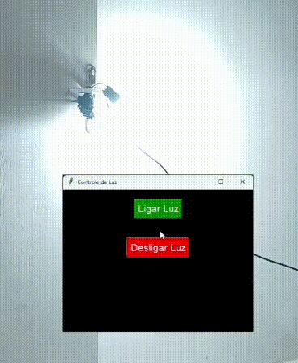

# Interface Python que controla o acionamento de uma simples lâmpada

O programa chama o IP onde está a lâmpada usando uma dependência chamada `requests`:

```python
requests.get('SEU_IP_AQUI')
```

Após isso, eu uso `tkinter` para fazer uma interface simples para o programa.

# Projeto da luz

# Demonstração



Sobre o projeto da luz, caso alguém queira replicar, serão necessários alguns equipamentos:

## Siga o fluxograma abaixo:

[Fluxograma do projeto](https://miro.com/app/board/uXjVGgBPFrI=/?share_link_id=767813816629)

1. **ESP8266 ESP-01** = Peça responsável por se conectar à rede Wi-Fi para controlar diversos aparelhos; no nosso caso, o módulo relé.

2. **ESP-01S 5V** (esse é o módulo relé que citei).

3. E por fim, uma fonte que converte de `100–240VAC` para `5VDC`. (Recomendo a `HLK-20M05`).

No item 3 eu citei um conversor, MAS PODE SER QUALQUER OUTRO, desde que a saída seja de `5V`.

Por que 5V?

O `ESP-01S 5V` precisa de `5V` para funcionar. Ele é responsável por fazer o acionamento da lâmpada.

⚠️ O MÓDULO NÃO PODE SER ALIMENTADO COM `110V` OU `220V`, isso dará curto.
